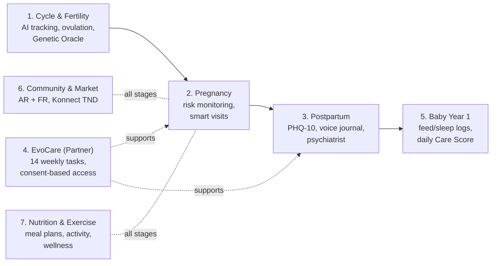
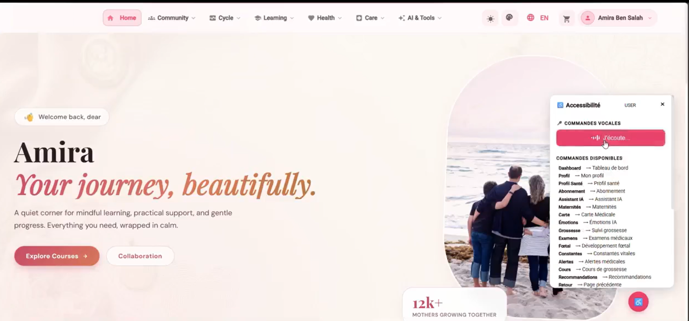
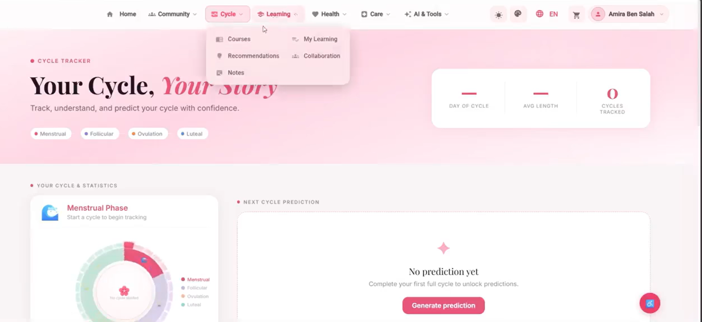
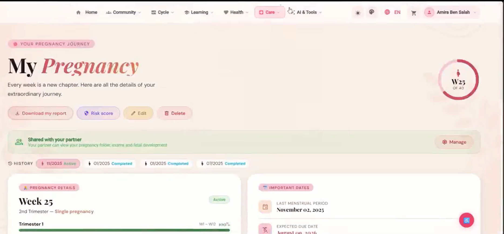
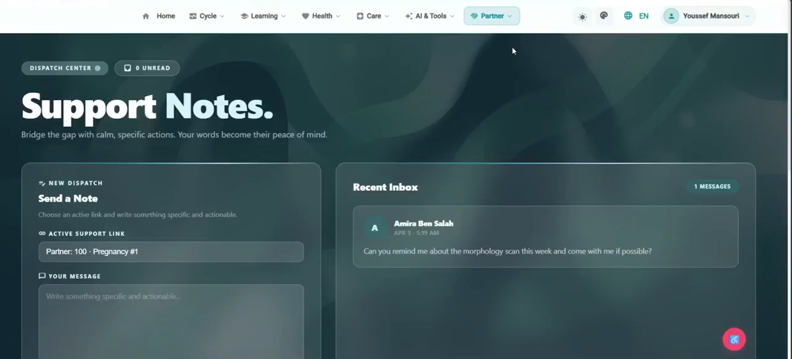
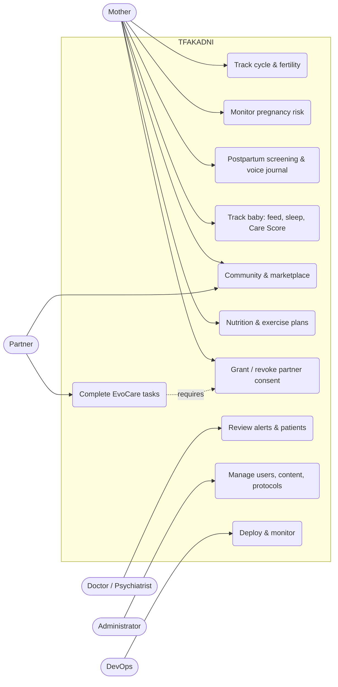
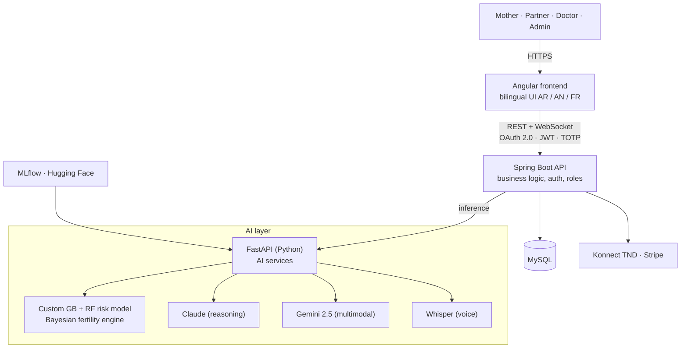
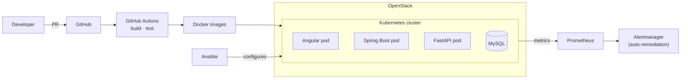
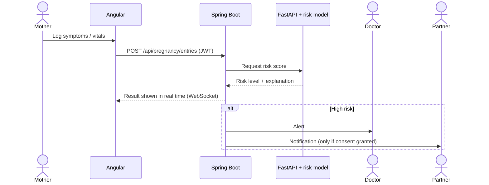

<div align="center">


# TFAKADNI

> **From the first cycle to the first cradle.**
> An AI-powered maternal health platform for Tunisia and the MENA region: one account, one continuous journey, from premarital health to baby's first year.

**Team:** The 7th Layer · ESPRIT · PI-CDIO · May 2026

</div>

---

## 1. Why TFAKADNI

1.2M Tunisian women aged 15–49 have no culturally adapted digital support. Today they juggle five disconnected apps (cycle, pregnancy, baby, community, doctor), none in Tunisian Arabic.

| Problem | Our answer |
|---|---|
| **Late**: risks are caught at the hospital, not at home | Proactive AI risk monitoring |
| **Alone**: the partner is a guest | EvoCare, a consent-based partner module |
| **Foreign**: no local language or payment | Arabic / Tunisian / French UI, Konnect TND |

## 2. Features: one platform, seven stages



Key differentiators: end-to-end journey, Tunisian-first design, **96.9% accuracy** risk model (trained on 12,000 Tunisian mother profiles), partner-inclusive, proactive AI (Cycle Twin, Baby Rhythm, Care Score), multi-AI stack.

## 3. Screenshots

<table>
  <tr>
    <td align="center" width="50%">
      
      <br/><b>Home</b> · welcome page with voice-command accessibility panel
    </td>
    <td align="center" width="50%">
      
      <br/><b>Cycle tracker</b> · phases, statistics and next-cycle prediction
    </td>
  </tr>
  <tr>
    <td align="center" width="50%">
      
      <br/><b>My Pregnancy</b> · weekly journey, risk score and partner sharing
    </td>
    <td align="center" width="50%">
      
      <br/><b>EvoCare (Partner)</b> · support notes between partners
    </td>
  </tr>
</table>

## 4. Actors

| Actor | Role |
|---|---|
| **Mother / Woman** | Main user. Owns her health data across all stages |
| **Partner** | Uses EvoCare, sees only what the mother consents to |
| **Doctor / Psychiatrist** | Receives alerts, follows up on risk and postpartum screening |
| **Administrator** | Manages users, content, clinical protocols and marketplace |
| **DevOps team** | Deploys, scales and monitors the platform |
| **External systems** | Claude, Gemini 2.5, Whisper (AI) · Konnect TND, Stripe (payments) |



## 5. Architecture



## 6. Cloud infrastructure & CI/CD

Multi-region, auto-scaling (100 → 1M+ users), end-to-end encryption, GDPR-aligned, role-based access, local data residency (Tunisia → Maghreb → MENA).



## 7. Example flow: pregnancy risk alert



## 8. Tech stack

| Area | Technologies |
|---|---|
| Frontend | Angular, bilingual UI (AR / AN / FR) |
| Backend | Spring Boot, FastAPI (Python), REST + WebSocket |
| Database | MySQL |
| AI / ML | Claude, Gemini 2.5, Whisper, GB+RF risk model, Bayesian fertility engine, MLflow, Hugging Face |
| Payment & auth | Konnect TND, Stripe, OAuth 2.0 + JWT, TOTP 2FA |
| Cloud & DevOps | OpenStack, Docker, Kubernetes, Ansible, GitHub Actions, Prometheus, Alertmanager |
| Clinical sources | 9 validated sources (incl. ACOG, ESHRE) |

## 9. SDGs

SDG 3 Good Health · SDG 4 Education · SDG 5 Gender Equality · SDG 9 Innovation · SDG 10 Reduced Inequalities · SDG 17 Partnerships

## 10. Roadmap

**Pilot:** 3 hospitals · 500 mothers · 12 months, then Maghreb → MENA → Francophone Africa.

## 11. Project structure

```
.
├── assets/     # README images
├── frontend/   # Angular app
└── backend/    # Spring Boot app
```

## 12. Getting started

```bash
git clone <REPO_URL>
cd <REPO_FOLDER>

# Frontend  (http://localhost:4200)
cd frontend && npm install && ng serve

# Backend
cd backend && ./mvnw spring-boot:run
```

## 13. Git workflow

```bash
git checkout -b your-name/feature-name        # e.g. missaoui/module-7
git checkout main && git pull origin main     # sync
git checkout your-name/feature-name && git merge main
git status && git add . && git commit -m "your commit message"
git push -u origin your-name/feature-name     # first time, then: git push
```

**Rules**

- Never work directly on `main`
- Always use your own branch
- Pull the latest `main` before starting new work
- Write clear commit messages
- Push your branch, then open a Pull Request on GitHub
